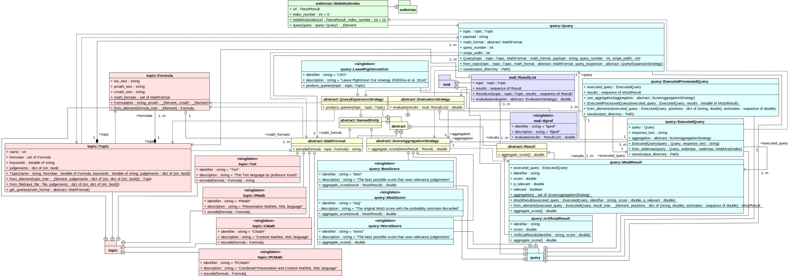

# Introduction
NTCIR MIaS Search is a Python 3 command-line utility that implements the Math
Information Retrival system that won the NTCIR-11 Math-2 main task (see the
[task paper][paper:aizawaetal14-ntcir11], and the [system description
paper][paper:ruzickaetal14-math]):

1. NTCIR MIaS Search loads [topics][www:ntcir-task-data] in the [NTCIR-10
   Math][paper:aizawaetal13-ntcir10], [NTCIR-11
   Math-2][paper:aizawaetal14-ntcir11], and [NTCIR-12
   MathIR][paper:zanibbi16-ntcir12] format.

2. NTCIR MIaS Search expands the topics into subqueries using the Leave
   Rightmost Out (LRO) query expansion strategy and submits the subqueries to
   [WebMIaS][www:WebMIaS].

3. NTCIR MiaS Search reranks the subquery results according using relevance
   probability estimates from the [NTCIR Math Density
   Estimator][www:ntcir-math-density] package, and produces a final result list
   by interleaving the subquery result lists. The final result list is stored
   in the TSV (Tab Separated Value) format, which is meant to be passed to the
   [MIREval][www:MIREval] tool.

[paper:aizawaetal13-ntcir10]: https://ntcir-math.nii.ac.jp/wp-content/blogs.dir/23/files/2013/10/01-NTCIR10-OV-MATH-AizawaA.pdf (NTCIR-10 Math Pilot Task Overview)
[paper:aizawaetal14-ntcir11]: https://citeseerx.ist.psu.edu/viewdoc/download?doi=10.1.1.686.444&rep=rep1&type=pdf (NTCIR-11 Math-2 Task Overview)
[paper:zanibbi16-ntcir12]: https://research.nii.ac.jp/ntcir/workshop/OnlineProceedings12/pdf/ntcir/OVERVIEW/01-NTCIR12-OV-MathIR-ZanibbiR.pdf (NTCIR-12 MathIR Task Overview)
[paper:ruzickaetal14-math]: http://research.nii.ac.jp/ntcir/workshop/OnlineProceedings11/pdf/NTCIR/Math-2/07-NTCIR11-MATH-RuzickaM.pdf (Math Indexer and Searcher under the Hood: History and Development of a Winning Strategy)

[www:MIaS]: https://github.com/MIR-MU/MIaS (MIaS)
[www:MIREval]: https://github.com/MIR-MU/MIREval (MIREval)
[www:ntcir-task-data]: https://www.nii.ac.jp/dsc/idr/en/ntcir/ntcir-taskdata.html (Downloading NTCIR Test Collections Task Data)
[www:ntcir-math-density]: https://github.com/MIR-MU/ntcir-math-density (NTCIR Math Density Estimator)
[www:WebMIaS]: https://github.com/MIR-MU/WebMIaS (WebMIaS)

# Usage
Installing:

    $ pip install ntcir-mias-search

Displaying the usage:

    $ ntcir-mias-search --help
    usage: ntcir-mias-search [-h] --dataset DATASET --topics TOPICS --positions
                             POSITIONS --estimates ESTIMATES --webmias-url
                             WEBMIAS_URL
                             [--webmias-index-number WEBMIAS_INDEX_NUMBER]
                             [--num-workers-querying NUM_WORKERS_QUERYING]
                             [--num-workers-merging NUM_WORKERS_MERGING]
                             --output-directory OUTPUT_DIRECTORY

    Use topics in the NTCIR-10 Math, NTCIR-11 Math-2, and NTCIR-12 MathIR format
    to query the WebMIaS interface of the MIaS Math Information Retrieval system
    and to retrieve result document lists.

    optional arguments:
      -h, --help            show this help message and exit
      --dataset DATASET     A path to a directory containing a dataset in the
                            NTCIR-11 Math-2, and NTCIR-12 MathIR XHTML5 format.
                            The directory does not need to exist, since the path
                            is only required for extracting data from the file
                            with estimated positions of paragraph identifiers.
      --topics TOPICS       A path to a file containing topics in the NTCIR-10
                            Math, NTCIR-11 Math-2, and NTCIR-12 MathIR format.
      --positions POSITIONS 
                            The path to the file, where the estimated positions of
                            all paragraph identifiers from our dataset were stored
                            by the NTCIR Math Density Estimator package.
      --estimates ESTIMATES 
                            The path to the file, where the density, and
                            probability estimates for our dataset were stored by
                            the NTCIR Math Density Estimator package.
      --webmias-url WEBMIAS_URL
                            The URL at which a WebMIaS Java Servlet has been
                            deployed.
      --webmias-index-number WEBMIAS_INDEX_NUMBER
                            The numeric identifier of the WebMIaS index that
                            corresponds to the dataset. Defaults to 0.
      --num-workers-querying NUM_WORKERS_QUERYING
                            The number of processes that will send queries to
                            WebMIaS. Defaults to 1. Note that querying, reranking,
                            and merging takes place simmultaneously.
      --num-workers-merging NUM_WORKERS_MERGING
                            The number of processes that will rerank results.
                            Defaults to 3. Note that querying, reranking, and
                            merging takes place simmultaneously.
      --output-directory OUTPUT_DIRECTORY
                            The path to the directory, where the output files will
                            be stored.

Querying a local WebMIaS instance using 64 worker processes:

    $ mkdir search_results
    
    $ ntcir-mias-search --num-workers-querying 8 --num-workers-merging 56 \
    >     --dataset ntcir-11-12 \
    >     --topics NTCIR11-Math2-queries-participants.xml \
    >     --estimates estimates.pkl.gz --positions positions.pkl.gz \
    >     --webmias-url http://localhost:58080/WebMIaS --webmias-index-number 1 \
    >     --output-directory search_results
    Reading topics from NTCIR11-Math2-queries-participants.xml
    50 topics (NTCIR11-Math-1, NTCIR11-Math-2, ...) contain 55 formulae, and 113 keywords
    Establishing connection with a WebMIaS Java Servlet at http://localhost:58080/WebMIaS
    Unpickling positions.pkl.gz
    Unpickling estimates.pkl.gz
    Querying WebMIaSIndex(http://localhost:58080/WebMIaS, 1), reranking and merging results
    Using 23 strategies to aggregate MIaS scores with probability estimates:
    - Log10 of the weighted geometric mean (alpha = 0.0) (look for 'geom0.0' in filenames)
    - Log10 of the weighted geometric mean (alpha = 0.1) (look for 'geom0.1' in filenames)
    - Log10 of the weighted geometric mean (alpha = 0.2) (look for 'geom0.2' in filenames)
    - Log10 of the weighted geometric mean (alpha = 0.3) (look for 'geom0.3' in filenames)
    - Log10 of the weighted geometric mean (alpha = 0.4) (look for 'geom0.4' in filenames)
    - Log10 of the weighted geometric mean (alpha = 0.5) (look for 'geom0.5' in filenames)
    - Log10 of the weighted geometric mean (alpha = 0.6) (look for 'geom0.6' in filenames)
    - Log10 of the weighted geometric mean (alpha = 0.7) (look for 'geom0.7' in filenames)
    - Log10 of the weighted geometric mean (alpha = 0.8) (look for 'geom0.8' in filenames)
    - Log10 of the weighted geometric mean (alpha = 0.9) (look for 'geom0.9' in filenames)
    - Log10 of the weighted geometric mean (alpha = 1.0) (look for 'geom1.0' in filenames)
    - Log10 of the weighted harmonic mean (alpha = 0.0) (look for 'harm0.0' in filenames)
    - Log10 of the weighted harmonic mean (alpha = 0.1) (look for 'harm0.1' in filenames)
    - Log10 of the weighted harmonic mean (alpha = 0.2) (look for 'harm0.2' in filenames)
    - Log10 of the weighted harmonic mean (alpha = 0.3) (look for 'harm0.3' in filenames)
    - Log10 of the weighted harmonic mean (alpha = 0.4) (look for 'harm0.4' in filenames)
    - Log10 of the weighted harmonic mean (alpha = 0.5) (look for 'harm0.5' in filenames)
    - Log10 of the weighted harmonic mean (alpha = 0.6) (look for 'harm0.6' in filenames)
    - Log10 of the weighted harmonic mean (alpha = 0.7) (look for 'harm0.7' in filenames)
    - Log10 of the weighted harmonic mean (alpha = 0.8) (look for 'harm0.8' in filenames)
    - Log10 of the weighted harmonic mean (alpha = 0.9) (look for 'harm0.9' in filenames)
    - Log10 of the weighted harmonic mean (alpha = 1.0) (look for 'harm1.0' in filenames)
    - The original MIaS score with the probability estimate discarded (look for 'orig' in filenames)
    Storing reranked per-query result lists in search_results
    Using 4 formats to represent mathematical formulae in queries:
    - Content MathML XML language (look for 'CMath' in filenames)
    - Combined Presentation and Content MathML XML language (look for 'PCMath' in filenames)
    - Presentation MathML XML language (look for 'PMath' in filenames)
    - The TeX language by professor Knuth (look for 'TeX' in filenames)
    Result list for topic NTCIR11-Math-9 contains only 188 / 1000 results, sampling the dataset
    Result list for topic NTCIR11-Math-17 contains only 716 / 1000 results, sampling the dataset
    Result list for topic NTCIR11-Math-26 contains only 518 / 1000 results, sampling the dataset
    Result list for topic NTCIR11-Math-39 contains only 419 / 1000 results, sampling the dataset
    Result list for topic NTCIR11-Math-43 contains only 924 / 1000 results, sampling the dataset
    get_results:  100%|███████████████████████████████████████████████| 50/50 [00:26<00:00,  1.88it/s]
    rerank_and_merge_results: 200it [01:02,  3.18it/s]
    Storing final result lists in mias_search_results
    100%|█████████████████████████████████████████████████████████████| 52/52 [00:13<00:00,  3.85it/s]
    
    $ ls search_results
    final_CMath.geom.tsv     final_PCMath.harm0.0.tsv  final_PMath.harm0.1.tsv
    final_CMath.harm0.0.tsv  final_PCMath.harm0.1.tsv  final_PMath.harm0.2.tsv
    final_CMath.harm0.1.tsv  final_PCMath.harm0.2.tsv  final_PMath.harm0.3.tsv
    final_CMath.harm0.2.tsv  final_PCMath.harm0.3.tsv  final_PMath.harm0.4.tsv
    final_CMath.harm0.3.tsv  final_PCMath.harm0.4.tsv  final_PMath.harm0.5.tsv
    final_CMath.harm0.4.tsv  final_PCMath.harm0.5.tsv  final_PMath.harm0.6.tsv
    final_CMath.harm0.5.tsv  final_PCMath.harm0.6.tsv  final_PMath.harm0.7.tsv
    final_CMath.harm0.6.tsv  final_PCMath.harm0.7.tsv  final_PMath.harm0.8.tsv
    final_CMath.harm0.7.tsv  final_PCMath.harm0.8.tsv  final_PMath.harm0.9.tsv
    final_CMath.harm0.8.tsv  final_PCMath.harm0.9.tsv  final_PMath.harm1.0.tsv
    final_CMath.harm0.9.tsv  final_PCMath.harm1.0.tsv  final_PMath.orig.tsv
    final_CMath.harm1.0.tsv  final_PCMath.orig.tsv     final_TeX.geom.tsv
    final_CMath.orig.tsv     final_PMath.geom.tsv      final_TeX.harm0.0.tsv
    final_PCMath.geom.tsv    final_PMath.harm0.0.tsv   ...

Querying a [remote WebMIaS instance][www:WebMIaS-demo] using 64 worker processes:

    $ mkdir search_results
    
    $ ntcir-mias-search --num-workers-querying 8 --num-workers-merging 56 \
    >     --dataset ntcir-11-12 \
    >     --topics NTCIR11-Math2-queries-participants.xml \
    >     --estimates estimates.pkl.gz --positions positions.pkl.gz \
    >     --webmias-url https://mir.fi.muni.cz/webmias-demo --webmias-index-number 0 \
    >     --output-directory search_results
    Reading topics from NTCIR11-Math2-queries-participants.xml
    50 topics (NTCIR11-Math-1, NTCIR11-Math-2, ...) contain 55 formulae, and 113 keywords
    Establishing connection with a WebMIaS Java Servlet at https://mir.fi.muni.cz/webmias-demo
    Unpickling positions.pkl.gz
    Unpickling estimates.pkl.gz
    Querying WebMIaSIndex(https://mir.fi.muni.cz/webmias-demo, 0), reranking and merging results
    Using 23 strategies to aggregate MIaS scores with probability estimates:
    - Log10 of the weighted geometric mean (alpha = 0.0) (look for 'geom0.0' in filenames)
    - Log10 of the weighted geometric mean (alpha = 0.1) (look for 'geom0.1' in filenames)
    - Log10 of the weighted geometric mean (alpha = 0.2) (look for 'geom0.2' in filenames)
    - Log10 of the weighted geometric mean (alpha = 0.3) (look for 'geom0.3' in filenames)
    - Log10 of the weighted geometric mean (alpha = 0.4) (look for 'geom0.4' in filenames)
    - Log10 of the weighted geometric mean (alpha = 0.5) (look for 'geom0.5' in filenames)
    - Log10 of the weighted geometric mean (alpha = 0.6) (look for 'geom0.6' in filenames)
    - Log10 of the weighted geometric mean (alpha = 0.7) (look for 'geom0.7' in filenames)
    - Log10 of the weighted geometric mean (alpha = 0.8) (look for 'geom0.8' in filenames)
    - Log10 of the weighted geometric mean (alpha = 0.9) (look for 'geom0.9' in filenames)
    - Log10 of the weighted geometric mean (alpha = 1.0) (look for 'geom1.0' in filenames)
    - Log10 of the weighted harmonic mean (alpha = 0.0) (look for 'harm0.0' in filenames)
    - Log10 of the weighted harmonic mean (alpha = 0.1) (look for 'harm0.1' in filenames)
    - Log10 of the weighted harmonic mean (alpha = 0.2) (look for 'harm0.2' in filenames)
    - Log10 of the weighted harmonic mean (alpha = 0.3) (look for 'harm0.3' in filenames)
    - Log10 of the weighted harmonic mean (alpha = 0.4) (look for 'harm0.4' in filenames)
    - Log10 of the weighted harmonic mean (alpha = 0.5) (look for 'harm0.5' in filenames)
    - Log10 of the weighted harmonic mean (alpha = 0.6) (look for 'harm0.6' in filenames)
    - Log10 of the weighted harmonic mean (alpha = 0.7) (look for 'harm0.7' in filenames)
    - Log10 of the weighted harmonic mean (alpha = 0.8) (look for 'harm0.8' in filenames)
    - Log10 of the weighted harmonic mean (alpha = 0.9) (look for 'harm0.9' in filenames)
    - Log10 of the weighted harmonic mean (alpha = 1.0) (look for 'harm1.0' in filenames)
    - The original MIaS score with the probability estimate discarded (look for 'orig' in filenames)
    Storing reranked per-query result lists in search_results
    Using 4 formats to represent mathematical formulae in queries:
    - Content MathML XML language (look for 'CMath' in filenames)
    - Combined Presentation and Content MathML XML language (look for 'PCMath' in filenames)
    - Presentation MathML XML language (look for 'PMath' in filenames)
    - The TeX language by professor Knuth (look for 'TeX' in filenames)
    get_results:  100%|███████████████████████████████████████████████| 50/50 [05:29<00:00,  6.58s/it]
    rerank_and_merge_results: 200it [06:57,  2.09s/it]
    Storing final result lists in mias_search_results
    100%|█████████████████████████████████████████████████████████████| 52/52 [00:13<00:00,  3.73it/s]
    
    $ ls search_results
    final_CMath.geom.tsv     final_PCMath.harm0.0.tsv  final_PMath.harm0.1.tsv
    final_CMath.harm0.0.tsv  final_PCMath.harm0.1.tsv  final_PMath.harm0.2.tsv
    final_CMath.harm0.1.tsv  final_PCMath.harm0.2.tsv  final_PMath.harm0.3.tsv
    final_CMath.harm0.2.tsv  final_PCMath.harm0.3.tsv  final_PMath.harm0.4.tsv
    final_CMath.harm0.3.tsv  final_PCMath.harm0.4.tsv  final_PMath.harm0.5.tsv
    final_CMath.harm0.4.tsv  final_PCMath.harm0.5.tsv  final_PMath.harm0.6.tsv
    final_CMath.harm0.5.tsv  final_PCMath.harm0.6.tsv  final_PMath.harm0.7.tsv
    final_CMath.harm0.6.tsv  final_PCMath.harm0.7.tsv  final_PMath.harm0.8.tsv
    final_CMath.harm0.7.tsv  final_PCMath.harm0.8.tsv  final_PMath.harm0.9.tsv
    final_CMath.harm0.8.tsv  final_PCMath.harm0.9.tsv  final_PMath.harm1.0.tsv
    final_CMath.harm0.9.tsv  final_PCMath.harm1.0.tsv  final_PMath.orig.tsv
    final_CMath.harm1.0.tsv  final_PCMath.orig.tsv     final_TeX.geom.tsv
    final_CMath.orig.tsv     final_PMath.geom.tsv      final_TeX.harm0.0.tsv
    final_PCMath.geom.tsv    final_PMath.harm0.0.tsv   ...

[www:WebMIaS-demo]: https://mir.fi.muni.cz/webmias-demo/ (Web Math Indexer and Searcher)

# Contributing

To get familiar with the codebase, please consult the UML class diagram in the
[Umbrello][www:Umbrello] project document [project.xmi](project.xmi):

[www:Umbrello]: https://umbrello.kde.org/ (Umbrello Project - Welcome to Umbrello - The UML Modeller)
